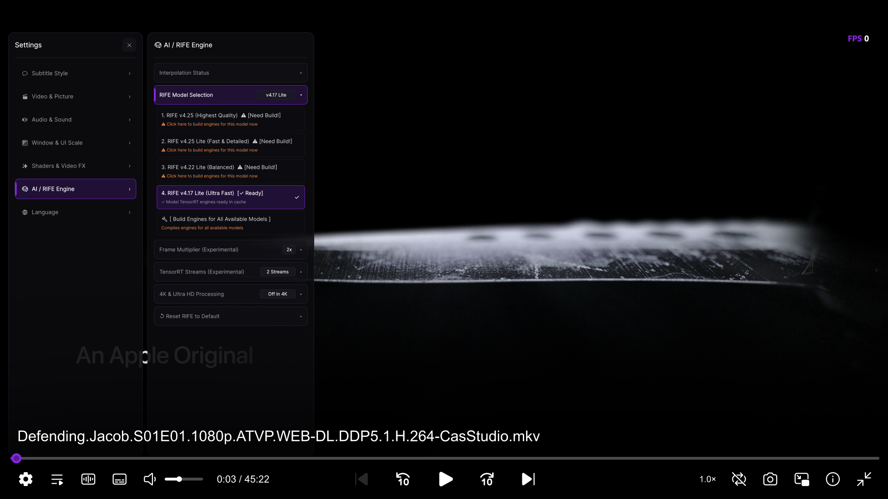

# MPV Flow (`mpv-flow`)

<p align="center">
  <a href="README.md"><b>English</b></a> | <a href="README_AR.md"><b>العربية</b></a>
</p>

A fully portable, zero-dependency multimedia player integrating **MPV**, an embedded **VapourSynth** environment, and **NVIDIA TensorRT** hardware acceleration to deliver real-time AI video frame interpolation using cutting-edge **RIFE** neural network models.

---

## 💻 Compatibility & System Requirements

> [!IMPORTANT]
> This project is currently tailored exclusively for the following environment:
> * **Operating System:** Windows 10 / 11 (64-bit).
> * **Graphics Card:** **NVIDIA RTX GPUs only** (RTX 2000, 3000, 4000, 5000 series or newer — **xx70 tier and above** such as RTX 3070 / 4070 / 5070 recommended for an optimal, stutter-free experience). Legacy GTX series cards are unsupported due to the lack of dedicated Tensor Cores.
> * **Supported Resolution:** **1080p (Full HD) and below only**. Ultra-high resolutions like **2K (1440p) and 4K (2160p)** are automatically bypassed (played natively without AI interpolation) to prevent VRAM saturation and severe rendering bottlenecks.
> * **Display Driver:** NVIDIA Driver version **580.00 or higher** for CUDA 13 and TensorRT 10 runtime support (automatically verified by `setup.bat`).

---

## 🌟 Overview & Key Features

* **Flexible AI Frame Multiplication:** Multiplies source video frame rates dynamically (2x, 3x, 4x, 5x, 6x) in FP16 precision using TensorRT acceleration, achieving cinematic fluidity based directly on the original video framerate.
* **100% Isolated & Portable:** Bundled Python and VapourSynth runtime inside the project directory — zero system pollution and no manual environment configuration required.
* **Modern Interface (ModernZ UI):** Sleek, glassmorphic dark-purple bottom control bar with full mouse and touch-screen navigation.
* **Interactive In-Screen Settings Sidebar:** Adjust RIFE models, multipliers, hardware streams, video shaders, fonts, and interface language live on the fly without interrupting video playback.
* **Full Bilingual Support (English / العربية):** The entire interface, control bar, and settings sidebar natively support both English and Arabic with one-click live language switching.
* **Real-Time FPS HUD:** Native in-frame render counter tracking actual display refresh rate and frame drops without relying on third-party utilities like RTSS.
* **Streaming & Media Center Bridges:** Seamless one-click external player integration for **Stremio** and a zero-conflict runtime bridge for **Harbor**.

---

<p align="center">
  
</p>

---

## 🚀 Quick Start

1. **Setup & Initialization:**
   * Download or clone this repository.
   * Run **`setup.bat`** once. The script will automatically verify your GPU driver compatibility, download required MPV and TensorRT runtimes, and compile the default Model 4 engine.
   > ⏳ **Important Note:** During the final setup step, an automated compiler window will open to assemble the TensorRT engine for your specific GPU. This process typically takes **1 to 3 minutes** and runs **only once**. Please allow it to complete and close automatically.
2. **Launch:**
   * Open **`mpv/mpv.exe`** directly or drag and drop any media file onto it to start enjoying ultra-smooth playback.

---

## ⚙️ Controls & Player Settings

### 1. Quick Hotkey:
* **`F1` Key:** Instant toggle to enable or disable RIFE frame interpolation on the fly, accompanied by an on-screen display (OSD) status indicator.

### 2. In-Screen Settings Sidebar:
Open the floating settings panel by clicking the **Settings icon (⚙️)** in the ModernZ bottom bar. It allows live tuning of all playback parameters without pausing playback:
* **RIFE Engine & Hardware Streams:** Select active RIFE model, frame rate multiplier (2x to 6x), GPU execution streams, and 4K/UHD bypass behavior.
  > 💡 **Important Multiplier Tip:** It is strongly recommended **not to exceed 3x**. Setting higher multipliers (such as 4x or 6x) introduces immense computational load that even high-end graphics cards cannot process smoothly in real-time, which will cause severe stuttering and frame drops instead of smooth motion.
* **Subtitles & Typography:**
  * Pre-loaded with high-grade multilingual and Arabic fonts in `mpv/portable_config/fonts/` (XB Zar, Cairo, Roboto, OpenSans, etc.).
  * **Custom Font Auto-Detection:** Drop any `.ttf` or `.otf` font file into the `fonts/` directory, and it will immediately appear in the sidebar options for live font, size, color, outline, and position adjustments.
* **Video Shaders & Enhancements:** Toggle Anime4K, FSRCNNX, CAS, and Adaptive sharpeners individually or clear all active shaders with a single click.
* **Real-Time FPS HUD:** Toggle the on-screen frame rate counter (disabled by default) and choose its display anchor (top-right, top-left, top-center).
* **Language & UI Scaling:** Instant switching between English and Arabic layouts, plus UI element and font scaling adjustments.

---

## 🧠 Supported RIFE Models

The project includes four distinct RIFE models optimized for different GPU performance tiers:

| Model # | Model Name | Description & Best Use Case | Recommended GPU Tier |
| :---: | :--- | :--- | :--- |
| **1** | **RIFE v4.25** | Highest optical precision and edge clarity for high-bitrate 1080p movies | RTX 3090 / 4080 / 5080 and above |
| **2** | **RIFE v4.25 Lite** | Exceptional detail with optimized memory footprint and balanced throughput | RTX 3080 / 4070 / 5070 |
| **3** | **RIFE v4.22 Lite** | Maximum consistency and artifact suppression for anime and television series | RTX 2080 / 3070 / 4070 |
| **4** | **RIFE v4.17 Lite** | Ultra-lightweight and fastest processing (Pre-compiled default) | All NVIDIA RTX GPUs |

---

## 🎨 Bundled Shaders & Video Enhancements

A curated collection of industry-standard GLSL and Hook shaders for live image upscaling and clarity enhancement, accessible under **Sidebar (`Settings -> Shaders`)**:

### 1. Anime Enhancement (Anime4K Suite)
* **Anime4K Restore CNN (M / VL):** Neural networks engineered to restore crisp linework and eliminate compression artifacts.
* **Anime4K Upscale CNN x2:** High-fidelity 2× neural super-resolution for animated content.
* **Anime4K Darken / Thin Lines:** Deepens ink outlines or thins heavy strokes for a crisp, refined modern aesthetic.

### 2. AI Neural Scalers
* **FSRCNNX x2 (16-0-4-1):** Deep 16-layer convolutional neural network for detailed video upscaling.
* **FSRCNNX x2 (8-0-4-1 LineArt):** Lightweight upscaler optimized specifically for line-art clarity.
* **RAVU Zoom AR R3:** Rapid accurate video upscaling equipped with anti-ringing compute shaders.

### 3. Clarity & Sharpening
* **AMD FidelityFX CAS:** Industry-standard Contrast-Adaptive Sharpening delivering crisp textures with zero halos.
* **AMD FSR RCAS:** Targeted luminance sharpening algorithm derived from AMD FSR 1.0.
* **Adaptive Sharpen:** Smart edge-masking sharpener that enhances contours while preserving flat gradient areas.

> 💡 **Custom Shaders Auto-Discovery:** Simply drop any third-party `.glsl` or `.hook` shader into `mpv/portable_config/shaders/`, and MPV Flow will automatically register it inside the sidebar menu for one-click toggling.

---

## 🛠️ TensorRT Engine Pre-Compilers (`tools/`)

Base AI models are stored in universal ONNX format. To pre-compile engines and eliminate runtime compilation delays, standalone batch tools are provided in the `tools/` directory:
* **`build_model_1.bat` through `build_model_4.bat`:** Compiles 1080p and 720p TensorRT engines for a specific model.
* **`build_all_engines.bat`:** Compiles all four models sequentially for instant in-player model switching.

---

## 🔗 External Platform Integrations

### 1. Stremio Integration
* Navigate to `stremio/` and execute **`link_with_stremio.bat`**.
* MPV Flow will register as Stremio's direct external player, launching automatically in fullscreen with full RIFE AI interpolation.
* To revert: run **`unlink_from_stremio.bat`**.

### 2. Harbor Player Integration
* Navigate to `harbor/` and execute **`link_with_harbor.bat`**.
* Links the portable VapourSynth runtime into Harbor and copies the required configuration snippet to your clipboard to paste into Harbor's Advanced settings.
* To revert: run **`unlink_from_harbor.bat`**.

---

## 📁 Repository Structure

```text
mpv-flow/
├── harbor/                      # Harbor integration tools
│   ├── harbor_bridge.py         # Runtime linker & bridge logic
│   ├── link_with_harbor.bat     # One-click Harbor link script
│   └── unlink_from_harbor.bat   # Unlink script
├── mpv/                         # MPV core and configuration
│   └── portable_config/         # Isolated portable configuration
│       ├── fonts/               # Bundled interface and subtitle fonts
│       ├── script-opts/         # Interface script configurations (ModernZ, etc.)
│       ├── scripts/             # Lua scripts (Settings sidebar, FPS HUD, etc.)
│       ├── shaders/             # Curated video shaders (Anime4K, FSR, CAS)
│       ├── vs/                  # Frame interpolation script (interpolation.vpy)
│       ├── input.conf           # Keybinding mappings
│       ├── mpv.conf             # Core MPV rendering parameters
│       └── player_settings.conf # Unified live configuration file
├── stremio/                     # Stremio external player integration
│   ├── link_with_stremio.bat    # One-click Stremio link script
│   ├── stremio_bridge.py        # Server.js bridge engine
│   └── unlink_from_stremio.bat  # Unlink script
├── tools/                       # TensorRT compilation utilities
│   ├── build_model_1.bat        # RIFE v4.25 engine compiler
│   ├── build_model_2.bat        # RIFE v4.25 Lite engine compiler
│   ├── build_model_3.bat        # RIFE v4.22 Lite engine compiler
│   ├── build_model_4.bat        # RIFE v4.17 Lite engine compiler
│   ├── build_all_engines.bat    # Batch compiler for all four models
│   └── build_all_engines.py     # Python trtexec / vsmlrt build engine
├── vs/                          # Isolated portable Python & VapourSynth runtime
│   ├── Lib/site-packages/       # Python packages (VapourSynth, vsmlrt)
│   ├── vs-coreplugins/          # Core VapourSynth plugins
│   ├── vs-plugins/              # Video filters and RIFE base ONNX models
│   ├── python.exe               # Embedded portable Python 3.12 interpreter
│   └── 7z.exe                   # Portable archive utility
├── .gitignore                   # Git exclusion rules for binary and hardware caches
├── README.md                    # Official English project documentation
├── README_AR.md                 # Official Arabic project documentation
├── setup.bat                    # One-click automated setup and deployment script
└── setup.py                     # Automated dependency installer & hardware tuner
```

---

## 👏 Credits & Acknowledgments

This project is built upon and inspired by exceptional open-source contributions:

* **[We0M/realtime-RIFE-portable](https://github.com/We0M/realtime-RIFE-portable):** The foundational inspiration and architectural reference for the portable standalone structure and initial RIFE + MPV integration.
* **[mpv player](https://github.com/mpv-player/mpv):** The gold standard of highly extensible, high-precision open-source media players.
* **[zhongfly/mpv-winbuild](https://github.com/zhongfly/mpv-winbuild):** For providing modern Windows binary builds with VapourSynth integration and active Git updates.
* **[AmusementClub/vs-mlrt](https://github.com/AmusementClub/vs-mlrt):** The brilliant machine learning inference plugin bridging NVIDIA TensorRT to VapourSynth.
* **[hzwer/Practical-RIFE](https://github.com/hzwer/Practical-RIFE):** The research and development team behind the state-of-the-art **RIFE** (Real-Time Intermediate Flow Estimation) optical flow algorithms.
* **[Fredrik Mellbin / VapourSynth](https://github.com/vapoursynth/vapoursynth):** The modern, high-performance video processing framework.
* **[ModernZ UI (Samillion)](https://github.com/Samillion/ModernZ):** For the sleek, touch-friendly purple On-Screen Controller.
* **[Bloc97 / Anime4K](https://github.com/bloc97/Anime4K):** For the high-speed real-time anime upscaling and line enhancement shaders.
* **[bjin / mpv-prescalers](https://github.com/bjin/mpv-prescalers):** For FSRCNNX and RAVU neural convolutional scalers.
